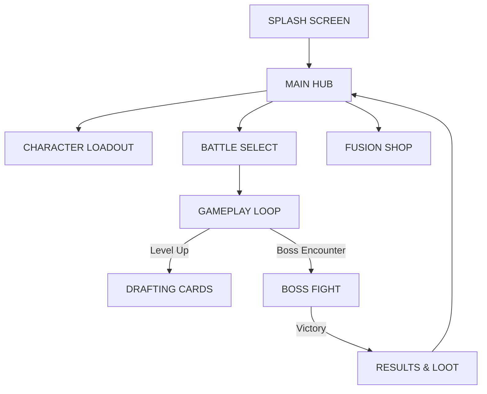

# **⚔️ PROJECT: ARCHSURVIVOR**
> **Game Design Document (GDD) - Final Master v5.0**
> *Roguelite Action RPG / Tactical Survivor / Deck-builder*

---

## **📂 1. TỔNG QUAN (GAME OVERVIEW)**

### **1.1. High Concept**
Một trò chơi sinh tồn hành động nơi kỹ năng di chuyển **(Hit & Run)** kết hợp với chiều sâu chiến thuật của việc xây dựng bộ bài **(Deck-building)**. 

> *ArchSurvivor cho phép người chơi **"Lập trình vận may"** thông qua hệ thống Loadout, Gộp thẻ và Tiến hóa Vũ khí, thay vì chỉ dựa vào may rủi thuần túy.*

### **1.2. Core Loop (Vòng lặp cốt lõi)**
1.  **🛡️ Prepare:** Chọn Tướng → Chọn Loadout (Thẻ Signature & Wishlist) → Mặc Trang bị.
2.  **⚔️ Action:** Vào Dungeon → Di chuyển né đòn → Dừng lại để tự tấn công → Giết quái rớt Nguyên liệu/Vàng.
3.  **🧬 Adapt:** Lên cấp → Chọn thẻ (Drafting) → Vũ khí tự động Tiến hóa → Gặp NPC Gộp thẻ.
4.  **💎 Evolve:** Về thành → Dùng tài nguyên nâng cấp Thẻ/Tướng/Trang bị → Mở khóa thử thách mới.

### **1.3. Art Direction (Visual Style)**
*   **Style:** Stylized Low-poly 3D (Poliigon/Synty style) kết hợp với 2D High-fidelity Card Art.
*   **VFX:** Colorful & Punchy. Sử dụng **Visual Effect Graph** (Unity 6) cho các hiệu ứng phép thuật và nhát chém.
*   **Palette:** 
    *   *Player:* Màu tươi sáng, độ tương phản cao để nổi bật giữa đám đông.
    *   *Enemies:* Tông màu tối, bão hòa thấp hơn (Lava Red cho Boss, Undead Green cho quái thường).

---

## **🕹️ 2. CƠ CHẾ GAMEPLAY (CORE MECHANICS)**

### **2.1. Điều khiển & Chiến đấu**
*   **Cơ chế chính:** `Stop-to-Attack` (Archero Style).
*   **Move:** Joystick ảo. Nhân vật **KHÔNG** tấn công khi đang di chuyển.
*   **Attack:** Thả tay (Input = 0) → Tự động khóa mục tiêu gần nhất.
*   **Active Skill:** Nút kỹ năng đặc trưng của từng nhân vật (có Cooldown).

### **2.2. Chiến thuật Tấn công (Strategy Pattern)**
Hệ thống sử dụng `AttackStrategySO` để định nghĩa:
*   **🪓 Melee:** Hitbox hình quạt/tròn. Ưu tiên **Knockback** (Đẩy lùi).
*   **🏹 Ranged:** Bắn Projectile (Đạn). Tính toán đường đạn, độ nảy và xuyên thấu.
*   **🤖 Summon:** Triệu hồi các Unit/Turret chiến đấu độc lập có AI riêng.

### **2.3. Tiến hóa Vũ khí (Weapon Evolution)**
Vũ khí thay đổi cả **Visual (Mesh)** và **Logic** dựa trên Level nhân vật:
| Stage | Level | Tên (Knight ví dụ) | Đặc điểm thay đổi |
| :--- | :--- | :--- | :--- |
| **Tier 1** | 1 - 4 | Iron Sword | Kiếm Sắt, tầm ngắn, dmg cơ bản. |
| **Tier 2** | 5 - 9 | Bastard Sword | Kiếm Bạc, tầm trung, tăng mạnh Knockback. |
| **Tier 3** | 10+ | **Excalibur** | Chém ra sóng năng lượng xuyên thấu. |

---

## **🎭 3. HỆ THỐNG NHÂN VẬT (CHARACTER ROSTER)**
*Mỗi nhân vật sở hữu: 1 Passive, 1 Active, và 1 Signature Deck.*

| Lớp (Class) | Vai trò | Nội tại (Passive) | Kỹ năng Chủ động | Thẻ Signature |
| :--- | :--- | :--- | :--- | :--- |
| **Knight** | Tanker | **Iron Will:** Giảm 15% dmg nhận. | **Shield Charge:** Húc khiên gây choáng. | *Retaliation* |
| **Barbarian** | Berserker | **Blood Rage:** Máu thấp = Atk Speed cao. | **Whirlwind:** Xoay rìu AOE. | *Undying* |
| **Ranger** | DPS | **Hawkeye:** +15% Crit Rate. | **Rain of Arrows:** Mưa tên làm chậm. | *Headshot* |
| **Mage** | Nuker | **Arcane Flux:** 20% tỉ lệ Double Cast. | **Meteor:** Thiên thạch gây dmg lớn. | *Chain Lightning* |
| **Engineer** | Summoner | **Scavenger:** Tăng tầm nhặt item. | **Deploy Turret:** Đặt tháp súng. | *Twin Turrets* |

---

## **🎴 4. HỆ THỐNG THÈ BÀI (THE GRIMOIRE)**

### **4.1. Độ hiếm (Rarity)**
*   ⚪ **Silver:** Chỉ số phẳng (+Flat Stats).
*   🟡 **Gold:** Chỉ số phần trăm (+% Stats).
*   🟣 **Platinum:** Thay đổi Mechanis (ví dụ: +1 Projectile, -20% Speed).
*   💎 **Diamond:** **High Risk - High Reward** (ví dụ: Bất tử 10s nhưng máu tối đa về 1).

### **4.2. Cơ chế Gộp Thẻ (Fusion System)**
*   **Recipe:** `Card A + Card B = Card C`
*   **UI:** Sử dụng UI Toolkit hiển thị xác suất kết quả (70% Gold, 20% Platinum, 10% Diamond).
*   **Duplicate:** Khi nhận thẻ đã có Max Level, tự động chuyển thành **Essence** dùng để đột phá thẻ khác.

### **4.3. Thuật toán Drafting**
1.  **Roll Rarity:** Random độ hiếm cho 3 ô lựa chọn.
2.  **Filter Pool:** Lọc thẻ (Common + Class + Wishlist).
3.  **Inject Wishlist:** Gấp 10 lần trọng số (Weight) cho thẻ trong Wishlist.
4.  **Cross-Class:** Cơ chế **Forbidden Scroll** (1% tỷ lệ) cho phép chọn thẻ của Class khác.

---

## **📈 5. CÂN BẰNG & CÔNG THỨC (BALANCING)**

### **5.1. Công thức Sát thương (Damage Formula)**
`Final Damage = (BaseATK + BonusFlat) * (1 + BonusPercentage) * (IsCrit ? CritMultiplier : 1) - EnemyDefense`

### **5.2. Scaling Quái vật**
Quái vật mạnh lên theo từng đợt (Wave) hoặc Phòng (Room):
*   **HP:** `BaseHP * (1.2 ^ WaveNumber)`
*   **ATK:** `BaseATK + (WaveNumber * 2)`

---

## **👾 6. BOSS DESIGN (PHASE LOGIC)**
Mỗi Boss có tối thiểu 2 Phase:
1.  **Phase 1 (100% - 50% HP):** Các đòn đánh chậm, dễ né.
2.  **Phase 2 (Dưới 50% HP):** **Enraged State**. Tăng 50% Speed, mở khóa các đòn AOE Bullet-hell.
3.  **Example Boss:** *The Necromancer King* - Phase 1 gọi Skeleton, Phase 2 triệu hồi hố đen hút người chơi.

---

## **🖥️ 7. GIAO DIỆN (UI/UX)**

### **Framework: UI Toolkit (Unity 6)**
*   **World Space UI:** Health Bar, Damage Numbers, Interactor Icons.
*   **Screen Space UI:**
    *   **HUD:** Thanh XP chạy ngang trên đỉnh, Kill Count góc phải, Active Skill tròn góc dưới phải.
    *   **Drafting Screen:** 3 thẻ dạng lật, có nút "Reroll" (tốn Gems) và "Banish" thẻ.

---

## **💰 8. KINH TẾ & TÀI NGUYÊN**

### **8.1. Tiền tệ (Currencies)**
*   **🪙 Gold (Vàng):** Tài nguyên cơ bản để nâng cấp thẻ & trang bị.
*   **💎 Gems (Đá quý):** Tài nguyên cao cấp để mua Tướng, Gacha.
*   **⚡ Energy (Thể lực):** Giới hạn lượt vào Dungeon, hồi theo thời gian.

### **8.2. Nguyên liệu Nâng cấp**
*   **📜 Scrolls (Bí kíp):** Đột phá thẻ (Atk / Def / Utility).
*   **🧩 Hero Shards:** Tăng sao cho Tướng (Mở khóa Passive mới).
*   **💎 Enhance Stones:** Nâng cấp chỉ số cho Trang bị (Áo, Nhẫn, Dây chuyền).

---

## **🛠️ 9. KIẾN TRÚC KỸ THUẬT (TECHNICAL)**

### **Tech Stack**
*   **Unity Version:** Unity 6 LTS (6000.3).
*   **DI Container:** VContainer.
*   **Reactive Logic:** R3 (Next-gen Unity Redux/Reactive).
*   **Asynchronous:** UniTask.
*   **Data Persistence:** EasySave 3.

### **Folder Structure (Actual & Proposed)**
```plaintext
Assets/_ArchSurvivor/
├── _Boot/              # Scene khởi đầu & Logic khởi tạo ứng dụng
├── App/                # Global Core (Interfaces, Global Services)
├── Art/                # Toàn bộ tài nguyên hình ảnh, model, VFX
├── Common/             # Utilities, EventBus, Constants dùng chung
├── Configs/            # ScriptableObjects dữ liệu chính của game
├── Document/           # Tài liệu thiết kế (GDD, Diagram)
├── Editor/             # Các công cụ tùy chỉnh trong Unity Editor
├── Installers/         # VContainer Scopes & Registrations
└── Features/           # Module hóa các tính năng (Logic + Resource)
    ├── Character/      # Data & Evolution cho từng lớp nhân vật
    ├── Combat/         # Hệ thống Damage, Projectiles, Hitboxes
    ├── Enemy/          # AI, Model & Prefab quái vật
    ├── HUD/            # Giao diện trong trận đấu (HP Bar, Level)
    ├── MetagameUI/     # Giao diện Lobby, Shop, Grimoire
    ├── Player/         # Input, Controller (Archero Style)
    └── Skills/         # Card Logic, Drafting, Fusion System
```

---

## **🌳 10. HỆ THỐNG THIÊN PHÚ (TALENT TREE)**
*Nâng cấp vĩnh viễn áp dụng cho toàn bộ tài khoản.*

*   **Might:** Tăng sát thương (+5/cấp).
*   **Vitality:** Tăng máu tối đa (+50/cấp).
*   **Greed:** Tăng tỷ lệ rớt Vàng (+1%/cấp).
*   **Luck:** Tăng tỷ lệ ra thẻ hiếm khi Drafting.

---

## **🏆 11. NHIỆM VỤ & CHẾ ĐỘ CHƠI**

### **11.1. Trải nghiệm người dùng đầu tiên (FTUE)**
1.  **Màn 1-1:** Chỉ chơi Knight, giới thiệu di chuyển.
2.  **Màn 1-3:** Mở khóa Shop & Gacha.
3.  **Màn 1-5:** Mở khóa Loadout.
4.  **Hết Chương 1:** Mở khóa Fusion & Hard Mode.

### **11.2. Chế độ bổ sung**
*   **Daily Dungeon:** Hầm Vàng/Scroll đổi mới mỗi ngày.
*   **Endless Tower:** Leo tháp vô tận, nhận thưởng theo tuần.
*   **Survivor Pass:** Hệ thống Battle Pass 30 ngày.

---

## **🎵 12. ÂM THANH & CẢM XÚC**
*   **Impact SFX:** Phân biệt rõ âm thanh chém vào thịt và giáp.
*   **Haptics:** Rung phản hồi khi tấn công hoặc bị trúng đòn.
*   **Dynamic BGM:** Nhạc nền tăng tốc khi máu thấp hoặc đánh Boss.

---

## **📊 13. FLOW SƠ ĐỒ GAME**

